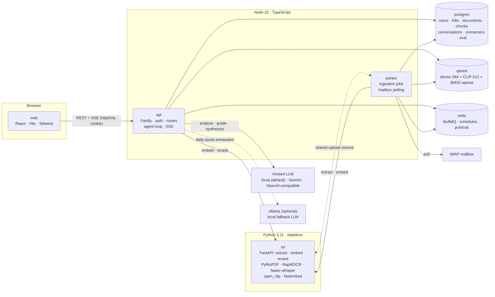
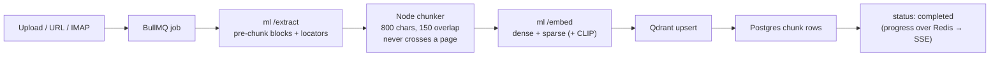
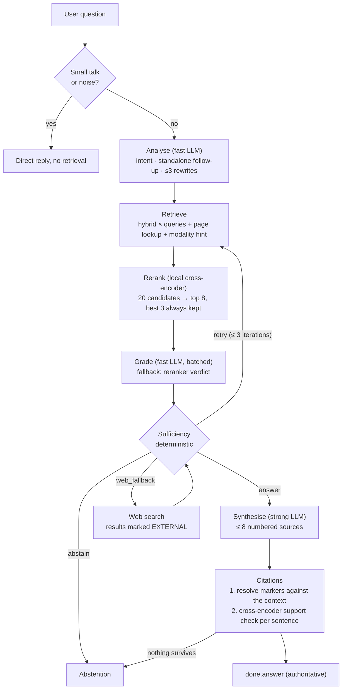

# trace — Project Report

**Multimodal agentic retrieval-augmented generation with verifiable, locator-level citations**

A question-answering system over your own documents. Every claim in an answer
carries a citation that resolves to a page and character span, a slide, an
image, or a timestamp, and the system refuses to answer when the corpus does
not support one.

| | |
|---|---|
| Repository | `trace` — pnpm + Turborepo monorepo |
| Size | ~20,500 lines across 168 TypeScript, TSX and Python source files |
| Deployment | 7 Docker Compose services (+1 optional local LLM) |
| Tests | 98 API unit tests passing (`pnpm --filter @trace/api test`), plus 7 ML extractor tests |
| Status as of | 28 September 2026 |

Companion documents in the repo, which this report summarises and does not
replace: [README.md](README.md) (setup and usage), [DECISIONS.md](DECISIONS.md)
(the reasoning behind each non-obvious choice, and a bug log),
[docs/PRIOR_ART.md](docs/PRIOR_ART.md) (what we read and what we took),
[eval/README.md](eval/README.md) (harness design), and
[trace-major-project-report.docx](trace-major-project-report.docx) (the
21 September report, which predates Phase 4 below).

---

## Contents

1. [Problem statement](#01--problem-statement)
2. [State of the art](#02--state-of-the-art)
3. [Objectives](#03--objectives)
4. [Project background](#04--project-background)
5. [Work distribution](#05--work-distribution)
6. [Supporting research papers](#06--supporting-research-papers)
7. [Proposed design — system architecture](#07--proposed-design--system-architecture)
8. [User features](#08--user-features)
9. [Prototype output](#09--prototype-output)
10. [Expected outcomes](#10--expected-outcomes)
11. [Conclusion](#11--conclusion)
12. [Future scope](#12--future-scope)

---

## 01 | Problem statement

Retrieval-augmented generation (RAG) is the standard way to make a language
model answer from a private corpus. Most implementations weaken the two
properties that would make such an answer usable as evidence.

1. **Coarse attribution.** An answer cites "handbook.pdf" or an opaque chunk
   index. To check a claim the reader has to reopen the source and search it.
   Citing *page 4, characters 1,180–1,960* turns that check into one click.
2. **A bias toward producing prose.** When retrieval finds nothing useful, the
   retrieved text is passed to the model anyway, and the model writes a fluent
   answer that has no support. An unsupported answer that reads confidently is
   worse than no answer.

Multimodal corpora make both problems worse. What people want to ask about is
scanned documents, lecture recordings, diagrams, slide decks, spreadsheets and
mail attachments. Each has a natural locator (a page, a slide, a row, a
timestamp), and a pipeline that flattens everything into plain text throws that
locator away.

**Problem.** Build a question-answering system over a user's own multimodal
corpus such that:

- every claim resolves to a specific location in a specific source, and that
  resolution is **verified before the answer is returned**;
- the system **abstains** when the corpus does not support an answer, visibly
  and through a decision procedure that can be audited;
- the retrieval process can be **observed while it runs**, not narrated after
  the fact;
- the whole stack **runs on a laptop with no GPU and no paid API**, so the
  evaluation behind the first two claims can actually be run.

---

## 02 | State of the art

### 2.1 Research landscape

| Approach | What it does | Gap relevant to this project |
|---|---|---|
| **Naive RAG** (retrieve top-k, then generate) | One retrieval pass, one generation | No relevance check, no way to refuse, citations at document level at best |
| **Hybrid retrieval** (dense + BM25, fused with RRF) | Serves both paraphrased questions and exact-term questions | Usually delegated to a library, so the fusion step can't be observed or tuned |
| **Cross-encoder reranking** | Re-scores the top candidates by reading query and passage together | Rarely reused to verify citations after generation |
| **Corrective RAG (CRAG)** | Grades retrieved documents, rewrites the query, falls back to web search | Binary grading, keeps documents when grading fails, no abstention path |
| **Self-RAG** | The model decides when to retrieve and critiques its own output | Needs a fine-tuned model; the decision is not deterministic |
| **Attributed generation / citation benchmarks (ALCE)** | Measures whether the cited passage supports the claim | Evaluation only, not enforced at answer time |
| **Multimodal RAG** (CLIP, OCR, ASR) | Brings images, scans and audio into the index | Often embeds a whole file as one vector, so there is no timestamp or page to cite |

### 2.2 Open-source implementations reviewed

Before design started we surveyed the closest public implementations and
recorded, for each one, what we adopted and what we rejected
([docs/PRIOR_ART.md](docs/PRIOR_ART.md)). No code was copied.

| Reference | What we read it for | What we did with it |
|---|---|---|
| `multimodal_agentic_rag` | React + FastAPI stack, embedding map, citation panel | Adopted 2 UI ideas; rejected the architecture |
| `corrective_rag` | Grade → rewrite → web fallback loop | Adopted the loop shape; rejected the implementation |
| `agentic_typed_rag_pydanticai` | Typed citations, explicit refusal, SSRF hardening | Strongest reference; adopted 3 mechanisms |
| `hybrid_search_rag` / `local_hybrid_search_rag` | Dense + keyword fusion | Rejected: fusion hidden inside a library |
| `vision_rag` | QA over images and PDF pages | Rejected: depends on a paid embedding API |
| `knowledge_graph_rag_citations` | Verifiable source attribution | Shaped our citation record |
| `gemini_agentic_rag` | Query rewriting, threshold as a tunable | Adopted threshold-as-configuration |
| `insurance_claim_live_agent_team` | Conversation on the left, live panel on the right; threadpool discipline | Adopted both |

### 2.3 Specific weaknesses we designed against

- **Persistence.** The closest multimodal reference keeps its store in three
  in-memory Python lists and computes cosine similarity in a list
  comprehension, so a restart loses the corpus. → We use Qdrant with named
  vectors, plus PostgreSQL.
- **Chunking destroys locators.** It collapses whitespace across the whole
  document before splitting, so page boundaries are lost. → Our chunker never
  merges across pages, and a property test enforces that.
- **Media collapse.** A one-hour video becomes one vector with no timestamp.
  → We index one chunk per transcript window, each with its start and end time.
- **A fabricated trace.** Its "trace" is built from hardcoded strings after the
  answer exists. → Ours is an append-only event bus written while each stage
  runs, and streamed over SSE.
- **Fail-open grading.** CRAG keeps a document when grading throws an error
  "to be safe", which favours answering exactly when judgement is least
  reliable. → We fail toward abstention (and, since Phase 4, toward a local
  reranker verdict; see §7.5).

---

## 03 | Objectives

| # | Objective | Status |
|---|---|---|
| O1 | **Multimodal ingestion**: text, digital and scanned PDFs, images, audio, video, DOCX, PPTX, XLSX/CSV, web pages and mail, each keeping its locator | Done |
| O2 | **Hybrid retrieval**: dense and BM25 fused with weighted reciprocal-rank fusion, with per-branch ranks reported | Done |
| O3 | **An agentic loop**: analyse → retrieve → rerank → grade → sufficiency → retry / web fallback / abstain → synthesise, as a real bounded loop | Done |
| O4 | **Verified citations**: markers resolved against the exact synthesis context, then checked for support by a cross-encoder; an answer left with no citation becomes an abstention | Done |
| O5 | **A reading interface**: the document open beside the answer, evidence shown in the form its modality needs, a live trace of each stage | Done (page-region box highlighting not yet) |
| O6 | **Conversational continuity**: persistent threads, follow-ups resolved for retrieval only | Done |
| O7 | **Continuous corpus growth**: an IMAP connector that keeps importing mail and attachments | Done |
| O8 | **Controlled evaluation**: agentic vs naive on the same corpus, prompt and resolver | Done; the benchmark needs re-running on the current code (§10) |
| O9 | **Free-tier operation**: CPU only, free hosted LLM tier, graceful degradation | Done |

---

## 04 | Project background

### 4.1 Why this project

The motivating case is a student or knowledge worker whose material is
scattered across formats: lecture recordings, scanned notes, slide decks,
spreadsheets, papers and email. General chatbots cannot see that material, and
typical "chat with your PDF" tools answer confidently without showing where an
answer came from. The value this project adds is **trust**: an answer you can
check in one click, and a refusal when there is nothing to check.

### 4.2 Constraints that shaped the design

- **No GPU, no paid API.** All extraction, OCR, transcription, embedding and
  reranking run locally on CPU. Only query analysis, grading and synthesis go
  to a hosted model, on its free tier.
- **Free-tier request quotas were the binding constraint.** Running the
  21-question dataset in both modes costs about 130 LLM requests, more than a
  day of the strictest free tier allows. This constraint produced:
  - a fast-model / strong-model split,
  - a token-bucket rate limiter with full-jitter retry,
  - a circuit breaker that falls back to a local Ollama model when the daily
    quota is exhausted,
  - and in Phase 4, a local cross-encoder that replaces most LLM grading calls.
- **Reproducibility.** One `docker compose up`; migrations run at boot; a seed
  script ingests one sample file per modality in about two minutes.

### 4.3 Timeline

| Phase | Scope | Evidence |
|---|---|---|
| 1 — Ingestion and the loop | Compose stack, ML service, chunker, hybrid retrieval, agent loop, citation resolver, SSE | DECISIONS.md "Phase 1" |
| 2 — The interface | Reading room, document reader, trace drawer, embedding map, compare mode | DECISIONS.md "Phase 2" |
| 3 — Evaluation | Harness, datasets, metrics, first report (17 Sep) | `eval/reports/2026-09-17…md` |
| 3b — Growth and continuity | IMAP mailboxes, threads, follow-up resolution, Groq default, Ollama fallback, the assistant "Vera", more rooms | Commit `a4f909d` (25 Sep), report .docx (21 Sep) |
| 4 — Retrieval quality and grounding (`863ad91`, 28 Sep) | Cross-encoder rerank, weighted RRF, page/slide lookup, keyword retries, single-source sufficiency, citation support check, Office/table parsing, PDF headings, noise detection, 34-question RAG benchmark | Working tree; `eval/reports/2026-09-25T19…md` |

> **Note.** Phase 4 is commit `863ad91` (68 files, +4,624 / −233).

---

## 05 | Work distribution

The code is split into three lanes with narrow, explicit interfaces between
them. The shared Zod contracts package is the one agreed boundary: both other
lanes compile against it, so it changes only by agreement.

| Lane | Owner | Code | Responsibilities |
|---|---|---|---|
| **The loop** | _[Member 1]_ | `apps/api/src/agent/**`, `apps/api/src/retrieval/**`, `apps/api/src/llm/**` | Agent state machine, analyse / rerank / grade / sufficiency / synthesise nodes, citation resolution and support check, hybrid search and fusion, LLM provider layer, rate limiter, fallback breaker |
| **The pipeline** | _[Member 2]_ | `apps/api/src/{routes,queue,ingest}/**`, `services/ml/**` | HTTP routes, auth, BullMQ worker, chunker, IMAP connector, URL ingestion + SSRF guard, the whole Python ML service (extractors, OCR, Whisper, CLIP, embeddings, reranker) |
| **The interface** | _[Member 3]_ | `apps/web/**`, `packages/contracts/**` | All routes and pages, reading room, document reader, trace timeline, embedding map, evaluation view, mailbox UI, shared contracts |
| Shared | All | `eval/**`, `DECISIONS.md`, `docker-compose.yml` | Datasets and labelling, evaluation runs, decision log, deployment |

_Fill in member names and roll numbers. The lane split comes from README.md
("Module ownership"); the name-to-lane mapping is not recorded in the repo._

---

## 06 | Supporting research papers

These papers are the research basis for the design choices. The repo's own
prior-art record (§2.2) lists code implementations; this list is the matching
literature.

| # | Paper | Where it is used in trace |
|---|---|---|
| 1 | Lewis et al., *Retrieval-Augmented Generation for Knowledge-Intensive NLP Tasks*, NeurIPS 2020 (arXiv 2005.11401) | The base RAG formulation. Also the main document in our 34-question benchmark corpus |
| 2 | Yan et al., *Corrective Retrieval Augmented Generation (CRAG)*, 2024 (arXiv 2401.15884) | The shape of our loop: grade → re-retrieve with rewritten queries → web fallback |
| 3 | Asai et al., *Self-RAG: Learning to Retrieve, Generate, and Critique through Self-Reflection*, 2023 (arXiv 2310.11511) | Grading and self-critique. We chose a deterministic gate instead of a learned one (§7.5) |
| 4 | Cormack, Clarke & Büttcher, *Reciprocal Rank Fusion outperforms Condorcet and individual Rank Learning Methods*, SIGIR 2009 | RRF fusion of the dense and BM25 branches; we add per-branch weights |
| 5 | Robertson & Zaragoza, *The Probabilistic Relevance Framework: BM25 and Beyond*, 2009 | The sparse lexical branch (served by Qdrant with an IDF modifier) |
| 6 | Karpukhin et al., *Dense Passage Retrieval for Open-Domain Question Answering*, EMNLP 2020 | Dense bi-encoder retrieval |
| 7 | Xiao et al., *C-Pack: Packaged Resources to Advance General Chinese Embedding* (BGE), 2023 (arXiv 2309.07597) | `BAAI/bge-small-en-v1.5`, the 384-dimension dense embedder |
| 8 | Nogueira & Cho, *Passage Re-ranking with BERT*, 2019 (arXiv 1901.04085) | Cross-encoder reranking over MS MARCO; our `ms-marco-MiniLM-L-12-v2` reranker |
| 9 | Wang et al., *MiniLM: Deep Self-Attention Distillation*, NeurIPS 2020 | The small reranker architecture that makes CPU reranking feasible |
| 10 | Radford et al., *Learning Transferable Visual Models From Natural Language Supervision* (CLIP), ICML 2021 | 512-dimension image vectors (`ViT-B-32`, open_clip) |
| 11 | Radford et al., *Robust Speech Recognition via Large-Scale Weak Supervision* (Whisper), 2022 (arXiv 2212.04356) | Audio and video transcription with timestamps (faster-whisper) |
| 12 | Gao et al., *Enabling Large Language Models to Generate Text with Citations* (ALCE), EMNLP 2023 (arXiv 2305.14627) | Citation precision and support as evaluation targets; the idea behind our sentence-level support check |
| 13 | Es et al., *RAGAS: Automated Evaluation of Retrieval Augmented Generation*, 2023 (arXiv 2309.15217) | Faithfulness and answer-relevance metrics; planned as future work (§12) |
| 14 | Ji et al., *Survey of Hallucination in Natural Language Generation*, ACM Computing Surveys 2023 | Motivates abstention and the "missing detail is not a missing topic" rule in the synthesis prompt |

---

## 07 | Proposed design — system architecture

### 7.1 Deployment view



| Service | Stack | Responsibility |
|---|---|---|
| `api` | Node 22, Fastify, TypeScript | Auth, uploads, URL ingestion, mailbox connectors, Qdrant queries, the agent loop, SSE streaming |
| `worker` | Same image as `api`, different command | Ingestion jobs and mailbox polling, kept off the HTTP event loop |
| `web` | React, Vite, Tailwind, React Router | Landing page, dashboard, library, reading room, threads, evaluation, mailboxes, map |
| `ml` | Python 3.11, FastAPI | Extraction, embedding and reranking only; no database, no business logic |
| `postgres` | PostgreSQL + Drizzle migrations | All relational state (8 tables) |
| `qdrant` | Qdrant | One collection; dense, CLIP and BM25 sparse vectors on each point |
| `redis` | Redis + BullMQ | Job queue, repeatable mailbox schedules, ingestion-progress pub/sub |
| `ollama` | Ollama (compose profile) | Local LLM used only when a hosted daily quota runs out |

**Why two backends.** The extraction and embedding libraries that matter are
Python-only, while the agent loop benefits from TypeScript's type system and
shares contracts with the frontend. The boundary is enforced: Python holds no
database handle and makes no decisions. Files move between services on a
shared volume rather than in HTTP bodies, and the ML service checks that every
path it receives stays inside the upload root.

### 7.2 Ingestion pipeline



| Source | Extraction | Locator kept on each chunk |
|---|---|---|
| PDF (digital) | PyMuPDF, one block per page; heading inferred from font size / bold numbering | Page, character span, section heading |
| PDF (scanned) | Page rendered at 200 DPI, RapidOCR when a page yields < 40 characters | Page, plus the rendered page image |
| DOCX | python-docx; headings become section boundaries; tables kept as tables | Section heading |
| PPTX | python-pptx; one block per slide | Slide number and slide title |
| CSV / TSV / XLSX | Header-repeating 20-row table slices, plus a **statistics block computed in code** (count, sum, mean, median, min, max, top/bottom 3) | Sheet, row range |
| Web page | HTML → headings and text; table rows kept as rows | Page title, headings |
| Image | OCR text + CLIP vector + optional hosted caption | The image itself |
| Audio | faster-whisper (base, int8) with VAD and word timestamps | Start and end timestamp |
| Video | Audio as above, plus a keyframe every 30 s, captioned | Timestamps |
| Mail | Headers (sender, date, subject) prepended to the body; each attachment becomes its own document | Message, plus the attachment's own locators |
| Legacy `.doc` / `.ppt` | Gemini File API fallback (can be switched off) | Document level only |

**Chunking rules.** All character arithmetic happens in one module, in one
language, next to the code that writes it into a citation. Two rules govern
merging: *pages never merge* (a chunk spanning two pages has no single page
number) and *transcript segments always merge* (a few seconds of speech is too
little to retrieve against). Since Phase 4 a heading also starts a new chunk,
and every chunk records the section it sits under. The key test asserts a
property, not a value: every span a chunk reports lies inside the page text it
came from.

**Write order.** Chunks go to Qdrant before PostgreSQL. A crash between the two
leaves an orphan vector, which retrieval drops. The opposite order would leave
a chunk row pointing at a vector that doesn't exist, which shows up as a
citation to something that can't be retrieved.

### 7.3 Data model

| Table | Purpose |
|---|---|
| `users` | Credentials (argon2id, OWASP parameters) |
| `knowledge_bases` | A named corpus; the unit of retrieval scope |
| `documents` | One row per ingested artifact: modality, status, storage path, origin |
| `chunks` | Text, modality, block source (text/OCR/ASR/caption), page, char span, timestamps, section |
| `connectors` | IMAP connections: AES-256-GCM sealed credential, UIDVALIDITY + UID watermark |
| `conversations` / `messages` | Threads, mode per turn, stored citations and trace |
| `eval_runs` / `eval_results` | One row per run with its config, one per scored question |

In Qdrant, each point carries a 384-dimension dense vector (cosine), a
512-dimension CLIP vector and a BM25 sparse vector with the IDF modifier
enabled. Without that modifier, raw term frequencies are scored as plain dot
products and long documents are silently favoured. `kb_id` is copied onto every
point so that retrieval filters and deletions are a payload filter rather than
a join.

### 7.4 Retrieval

- For every query (the original, its resolved form, and rewrites), the dense
  and BM25 branches go to Qdrant in **one batch request**, each pulling
  `RETRIEVAL_PREFETCH_K = 40` candidates.
- They are merged in Node by **weighted RRF**: `score = Σ wᵦ / (k + rankᵦ)` with
  `k = 60`. Phase 3 used Qdrant's own server-side RRF, which has no weights,
  and a corpus full of exact codes ("TB-2048", "section 3.2") needs BM25 to be
  able to outvote a semantically similar but wrong passage.
- **Location lookup.** If the question names a page or slide ("what does slide
  3 say?"), a metadata-filtered search runs as well, and those chunks are
  *pinned* to the front.
- **Modality hints** add a filtered search but never replace the open one. As a
  hard filter they used to hide answers: "slide" was read as "image", and a
  PowerPoint's slides are text.
- Qdrant stores only a preview of each chunk. The full text and exact locator
  are read back from PostgreSQL before the model sees them.

### 7.5 The agent loop



| Stage | What it does | Key parameters |
|---|---|---|
| **Small talk / noise** | Rule-based: greetings, identity questions, acknowledgements, and keyboard mash ("fnj3f3", "asdf", "???") are answered without retrieval. Acronyms, filenames and non-Latin scripts are exempt | `MAX_WORDS` |
| **Analyse** | Fast model returns intent, a **standalone query** for follow-ups, and 2–3 rewrites that keep names, numbers, codes and section numbers verbatim (one keyword-only, one concept-level; one per side for a comparison). Fails fast: 1 retry, ≤ 20 s | — |
| **Retrieve** | §7.4. Agentic mode casts wider because rerank narrows afterwards | `RETRIEVAL_CANDIDATES=20` |
| **Rerank** | `ms-marco-MiniLM-L-12-v2` scores (resolved question, passage) pairs; sigmoid onto 0–1. The top 3 always reach the grader, because the model reads tables poorly (it scored a "mean 72" stats block 0.0099 for "what is the average score?") | `RERANK_TOP_K=8`, `RERANK_MIN_KEEP=3`, `RERANK_MIN_SCORE=0.01` |
| **Grade** | Fast model grades batches of 12 (800 chars each): `{chunkId, relevant, score, reason}`. If a batch fails (usually a per-minute rate limit), **the reranker's score stands in** under its own threshold, so a rate limit no longer looks like "no evidence" | `RERANK_FALLBACK_MIN_SCORE=0.2`, `GRADE_WITH_LLM` |
| **Sufficiency** | **Deterministic.** Answer if ≥ 2 strong passages, **or** one passage both judges rate highly (grader ≥ 0.85 and rerank ≥ 0.5, or rerank-only ≥ 0.95), **or** one passage retrieved at the page the question named. Otherwise retry with untried rewrites, then keyword-only forms, then web fallback, then abstain. Records a `retrievalConfidence` (mean of the top-3 evidence scores) | `SUFFICIENCY_MIN_SCORE=0.55`, `SUFFICIENCY_MIN_RELEVANT_CHUNKS=2`, `SUFFICIENCY_SINGLE_SOURCE_*`, `AGENT_MAX_ITERATIONS=3` |
| **Synthesise** | Strong model, ≤ 8 sources, each labelled with filename, page or slide, and section. The prompt forbids invented locations; requires "the documents do not provide it" for a missing detail; requires conflicting sources to be flagged; requires outside knowledge to start with "Outside your documents," and carry no citation; follows the requested form (ELI10, MCQ, table) | `SYNTHESIS_MAX_SOURCES=8` |
| **Citations** | (1) Every `[^n]` must point at a source that was in the context; any other marker is dropped and listed in `rejectedMarkers`. (2) Each cited sentence is scored against its passage by the cross-encoder; below the threshold the marker is dropped (`unsupportedMarkers`), and a sentence left with no support is removed. If nothing survives, the answer becomes an abstention | `CITATION_MIN_SUPPORT=0.02` |

**Why the gate is deterministic.** Sufficiency is the setting an evaluation
sweeps to trade false answers against over-abstention. That sweep only means
something if the same inputs always give the same decision. Both thresholds are
environment variables and are echoed into every trace, so a trace read months
later still explains its own decision.

**Two kinds of refusal.** "The documents don't contain this" (abstention) and
"the AI service is busy" (`GRADING_FAILED_TEXT`) are different messages. A
model outage is not a claim about the user's corpus.

**Follow-ups.** Only the analysis stage sees conversation history. Prior turns
never enter the synthesis context, so an earlier answer can never become a
citable source for a later one. Naive mode ignores history on purpose, so that
compare mode measures retrieval strategy only.

### 7.6 Streaming contract

Asking a question takes two calls. `POST /chat/:conv/messages` reserves the
assistant message, and `GET /chat/stream/:msg` runs the loop and streams SSE
frames:

| Frame | Content |
|---|---|
| `agent` | One per stage start/complete/fail, with real timings and payload (grades, rerank candidates, decision + thresholds + confidence, synthesis sources) |
| `token` | Provisional answer text |
| `citations` | Verified citation records |
| `done` | **Authoritative** answer. It can differ from the streamed tokens, because tokens already sent can't be withdrawn if verification later turns the answer into an abstention |
| `error` | Code and message |

### 7.7 LLM provider layer

| Provider | Free allowance | Role |
|---|---|---|
| Groq | ~1,000 requests/day per model | Default, chosen for its allowance |
| Gemini | ~20/day on the strongest flash model | Supported; also the optional image captioner |
| OpenAI-compatible | — | Supported for completeness |
| Ollama (local) | Unlimited | Fallback when a daily quota is exhausted |

- A **token bucket** with full-jitter retry honours the server's `retry-after`.
- **Daily exhaustion is terminal** on the first response. Only that case trips
  the process-wide breaker to Ollama, which half-opens after a cooldown.
- Streaming picks its provider before the first token and never switches
  mid-answer.
- The fallback changes fluency, not grounding: citation resolution and
  abstention run on whatever text any provider produced.

### 7.8 Security

- argon2id password hashing (19 MiB, 2 passes). Login verifies against a dummy
  hash for unknown accounts, so a missing account and a wrong password take the
  same time to reject.
- The session JWT lives in an **httpOnly cookie**, not browser storage.
- **SSRF guard on every redirect hop** for URL ingestion and for the IMAP host.
  The blocklist is defined as "not globally routable", which covers CGNAT,
  IPv4-mapped IPv6 and NAT64.
- Mailbox credentials are sealed with **AES-256-GCM** under a key derived from
  the JWT secret, and never returned to the browser.
- Known and recorded gap: DNS rebinding is not fully closed (§12).

---

## 08 | User features

| Route | Feature |
|---|---|
| `/` | Landing page explaining the system |
| `/signin` | Register / sign in |
| `/app` | Knowledge bases: create, open, delete |
| `/app/kb/:id` | **Overview**: document and chunk counts, modality mix, connected mailboxes, recent threads and documents |
| `/app/kb/:id/library` | **Library**: the corpus grouped by where it came from (Uploaded, From a URL, one entry per mailbox). The filter is a query parameter, so a filtered view is a shareable link. Upload with live ingestion progress |
| `/app/kb/:id/ask` | **Reading room** (details below) |
| `/app/kb/:id/threads` | **Threads**: every conversation, searchable by its opening question |
| `/app/kb/:id/evaluation` | **Evaluation**: harness runs side by side (agentic vs naive) with the better value marked, the thresholds each run used, and every question's result |
| `/app/kb/:id/mailboxes` | **Mailboxes**: connect IMAP with an app password, see sync state, last sync, counts |
| `/app/kb/:id/map` | **Embedding map**: every chunk as a point in a rotatable 2D/perspective PCA projection, coloured by document |

**The reading room.**

- **Vera**, the assistant, introduces herself on an empty thread: what she
  answers from, that every sentence carries a number, and that she refuses
  rather than guesses. While the loop runs she reports the stage it's actually
  in, read from the same event bus as the trace.
- **Numbered claims.** Hovering a marker fades the sentences it doesn't
  support, lifts the matching source card, and scrolls the reader to the page.
- **The document reader** opens beside the answer, and the divider between them
  can be dragged. PDFs scroll continuously with a page rail, zoom, fit-width
  and fit-page. Audio and video get a timeline with the cited span marked. Text
  and mail show the cited span marked in place. Images are shown as the image.
- **Grounding strip**: claims made, claims verified, and markers discarded, on
  screen rather than in a log.
- **Modes**: `agentic`, `naive`, and `compare` (runs both, one after the other,
  with the traces side by side).
- **Trace drawer** (the agent timeline): one row per stage with its real
  duration, the grader's reasons, reranker scores, the sufficiency rationale,
  the retrieval confidence, and the numbered sources synthesis read.
- **Threads** persist and resume. Earlier turns keep live citations because
  stored answers render through the same component as streaming ones.
- **Follow-ups** ("and what about those in a recording?") are resolved and
  shown as `standaloneQuery` in the trace.
- **Theme toggle** (light/dark) and an account menu.

---

## 09 | Prototype output

The prototype runs end to end with `docker compose up`, which serves web on
:5174, API on :8080, ML on :8000 and the Qdrant dashboard on :6333.
`pnpm seed` creates `demo@trace.local` and ingests the sample corpus:
`handbook.pdf`, `scanned-notes.pdf` (OCR path), `architecture.png`,
`briefing.mp3` and `lecture.mp4`.

### 9.1 What an answer looks like

For a question such as *"How does chunking handle page boundaries?"*, the
stream produces:

1. `agent` frames for analyse → retrieve → rerank → grade → sufficiency →
   synthesise → citations, each with timings.
2. Tokens of an answer such as *"A chunk never spans two pages; the chunker
   flushes at every page boundary so each chunk has exactly one page
   number.[^1]"*
3. A citation record resolving marker 1 to an exact location:

```json
{
  "marker": 1,
  "filename": "handbook.pdf",
  "modality": "pdf",
  "source": "text",
  "page": 2,
  "charStart": 412,
  "charEnd": 1203,
  "tsStart": null,
  "tsEnd": null,
  "section": "3. Chunking",
  "snippet": "…",
  "external": false
}
```

_(Illustrative values. The field set is exactly `citationSchema` in
`packages/contracts/src/citations.ts`.)_ For audio and video, `tsStart` and
`tsEnd` are filled instead. For PPTX, `page` is the slide number and `section`
is the slide title.

4. The sufficiency event, which explains itself:
   `decision: "answer"`, `rationale`, `thresholds {minRelevantChunks: 2, minScore: 0.55}`,
   `confidence {retrievalConfidence, topScore, candidateCount, rerankedCount, evidenceCount, basis}`.

For an unanswerable question ("What is RAG's stock price?") the gate or the
citation check produces an abstention, and the grounding strip shows zero
verified claims.

### 9.2 Measured results

The harness (`apps/api/src/eval/`) runs the real retrieval layer and the real
agent loop. Both modes share the synthesis prompt, the citation resolver and
the corpus, so any difference comes from the retrieval strategy.

**A. Sample corpus**: 5 documents, 20 chunks, 21 questions (16 answerable, 5
not), 17 Sep 2026.

| k | precision@k | recall@k | hit@k | MRR |
|---|---|---|---|---|
| 1 | 100.0% | 89.6% | 100.0% | 1.000 |
| 3 | 45.8% | 100.0% | 100.0% | 1.000 |
| 5 | 28.7% | 100.0% | 100.0% | 1.000 |
| 12 | 13.0% | 100.0% | 100.0% | 1.000 |

| Metric | Agentic | Naive |
|---|---|---|
| Abstention accuracy | 95.2% | 100.0% |
| Citation precision | 89.7% | 96.8% |
| **Citations resolve** | **100.0%** | **100.0%** |
| Answer contains expected text | 100.0% | 100.0% |
| False answer rate | 20.0% | 0.0% |
| Over-abstention rate | 0.0% | 0.0% |
| Mean latency | 40.5 s | 11.4 s |
| Mean iterations | 2.24 | 1.00 |

The retrieval metrics are **saturated**: at k = 12 the retriever returns 12 of
the corpus's 20 chunks, and each question targets a different document. The
harness flagged this itself. The one false answer (u02) came from the web
fallback answering a question the corpus could not.

**B. RAG benchmark**: 34 questions over two real documents (the RAG paper,
arXiv 2005.11401, and the Wikipedia article on RAG ingested by URL). The
questions cover facts, semantics, keywords, numbers, sections, multi-hop,
comparisons, cross-document, summaries, extraction, generation, traps and
missing details. Run 25 Sep 2026, 19:11.

| Metric | Agentic | Naive |
|---|---|---|
| Questions | 34 | 34 |
| Abstention accuracy | 82.4% | 94.1% |
| Citation precision | 80.2% | 91.9% |
| **Citations resolve** | **100.0%** | **100.0%** |
| Answer contains expected text | 64.7% | 70.6% |
| **False answer rate** | **0.0%** | **0.0%** |
| Over-abstention rate | 22.2% | 7.4% |
| Mean latency | 12.2 s | 13.7 s |
| Mean iterations | 1.65 | 1.00 |

- **Every trap and missing-detail question was refused in both modes.** This
  includes "Who is the CEO of RAG?", "What is BERT's stock price?", and "What is
  the capital of Australia?" (general knowledge that isn't in the corpus).
- Agentic mode over-abstained on numeric and multi-hop questions (num-01,
  num-02, hop-02), on sec-01 and fact-04, and on gen-01 ("Explain RAG like I'm
  10"). These are the cases the Phase 4 work targets: single-source
  sufficiency, keyword retries, page/section lookup and form-following in
  synthesis.

**C. Other runs, recorded for completeness**

- *25 Sep, 15:51, sample corpus*: over-abstention jumped to 81.3% agentic /
  68.8% naive, with 0% false answers. This matches the failure described in the
  Phase 4 grade-node comment: rate-limited grading batches were dropped, so a
  rate limit looked the same as "no evidence". That is what led to the reranker
  fallback.
- *25 Sep, 21:34, RAG benchmark, agentic only*: 76.5% abstention accuracy, 0%
  false answers, and a 250.8 s mean latency. The report doesn't record the
  cause; the latency is consistent with long rate-limit waits, which the
  Phase 4 fail-fast change (1 retry, ≤ 20 s) addresses.

> **Caveat.** None of these reports records which code revision it ran
> against, and the current working tree (Phase 4) has not been benchmarked as
> a whole. Re-run B on the current tree before presenting final numbers (§10).

**D. Unit tests**: 98/98 API tests pass, covering chunking and structure,
pipeline nodes (rerank pruning, sufficiency, citation support stripping,
keyword queries, page lookup), small-talk and noise detection, eval metrics,
the SSE parser, the rate limiter, the fallback breaker, IP rules and secret
sealing. There are also 7 Python extractor tests (Office, tables, text).

---

## 10 | Expected outcomes

What the project is expected to show, and how each outcome is measured:

| Outcome | Measure | Current evidence | Target |
|---|---|---|---|
| Every emitted citation is checkable | `citations resolve` | 100% in every run, both modes | 100%, enforced by construction |
| No confident wrong answers | `false answer rate` | 0% on the 34-question benchmark, both modes | 0% |
| Refusal isn't over-eager | `over-abstention rate` | 22.2% agentic / 7.4% naive (pre-Phase 4) | Agentic ≤ naive after the Phase 4 re-run |
| Citations point at the right document | `citation precision` | 80.2% / 91.9% | ≥ 90% agentic |
| Cited sentences are actually supported | `unsupportedMarkers` per answer (new) | Measured per answer in the trace since Phase 4 | Report as a new metric |
| The agentic loop earns its cost | Agentic vs naive on a confusable corpus | Not yet shown; the sample corpus is saturated | Agentic > naive on answer quality at equal false-answer rate |
| Runs on a laptop at zero cost | Hardware and bill | CPU only, free tiers, 16 GB RAM recommended | Maintained |

**Expected impact.** A reader can verify any sentence in one click, whether it
comes from a scanned page, a slide, a spreadsheet row or a second in a lecture
recording. The system says "the documents do not provide it" instead of
guessing, and it tells a service failure apart from a gap in the corpus.

---

## 11 | Conclusion

trace makes a retrieval-augmented answer checkable. It ingests more than ten
source formats through a local CPU-only pipeline that keeps each format's
natural locator. It retrieves with dense and lexical branches merged by
weighted RRF and refined by a local cross-encoder. It grades evidence with an
LLM, with the reranker standing in when the LLM is rate-limited. It decides
between answering, retrying, escalating and refusing through a deterministic
gate whose thresholds are configuration. And it verifies every citation twice
before an answer is returned: once for being in context, once for supporting
its sentence.

The measurements support the narrow claims. **Every emitted citation resolved
in every run, and on the 34-question benchmark the system gave no false answer
in either mode**, refusing every trap and missing-detail question. The broad
claim, that the agentic loop beats a single pass, is **not yet shown**. On the
sample corpus, single-pass retrieval already ranks the answer first every time,
so only the loop's costs show up. On the RAG benchmark the pre-Phase 4 loop
over-abstained more than the baseline. The harness surfaced both results
itself, and they are reported here rather than hidden behind saturated
retrieval scores. Phase 4 was built to address exactly those failures, and
re-running the benchmark on it is the next step.

Much of the engineering value doesn't show in a metrics table:

- a chunker whose page and span guarantees are pinned by a property test;
- a trace recorded while the stages run, not written up afterwards;
- a gate kept deterministic so that threshold sweeps mean something;
- a provider layer that degrades in fluency without weakening grounding;
- a decision log that records what was tried, what failed, and what only a
  browser could reveal (the CORS headers bypassed by raw-socket SSE writes).

---

## 12 | Future scope

**Evaluation (highest priority)**

- Re-run the 34-question benchmark in both modes on it,
  recording the git revision with each run.
- Build a **confusable corpus** (many documents on overlapping topics, which a
  connected mailbox produces naturally) so the agentic-vs-naive comparison can
  tell the two apart.
- **Threshold sweep** over `SUFFICIENCY_MIN_SCORE`, the minimum chunk count and
  the single-source bars, plotting false-answer rate against over-abstention.
  Per-run config is already stored.
- Add **faithfulness / entailment metrics** (RAGAS-style) alongside
  `unsupportedMarkers`.

**Retrieval and grounding**

- Weight external web evidence below corpus evidence in the gate, or require
  corpus evidence to answer at all. That removes the failure behind the 20%
  false-answer rate on the sample corpus.
- Retrieval over the table statistics blocks, which the reranker currently
  misreads; consider a table-aware reranker.
- Multilingual embeddings and reranker for non-English corpora.

**Interface**

- **Page-region highlighting**: keep word geometry during PDF extraction and
  feed the existing `HighlightLayer.tsx`, which already accepts rectangles.
- Show the retrieval confidence and unsupported-marker counts in the grounding
  strip.

**Ingestion**

- Group mail threads into one document. Replace polling with IMAP IDLE.
- Native `.doc` / `.ppt` parsing, removing the last cloud fallback.
- Diagram understanding with a local vision-language model instead of the
  hosted captioner.

**Platform and security**

- Close the DNS-rebinding window (connect to the validated IP with the Host
  header preserved).
- Token-level streaming for the OpenAI-compatible provider.
- Multi-user sharing of knowledge bases; horizontal scaling of workers and
  Qdrant.
- Register-aware synthesis (legal vs informal sources) with identical citation
  rules, and grounded reply drafts for received mail.

---

### Appendix A — Key configuration defaults

| Parameter | Default | Purpose |
|---|---|---|
| `CHUNK_SIZE_CHARS` / overlap | 800 / 150 | Sentence-boundary chunks with carry-over |
| `RETRIEVAL_PREFETCH_K` | 40 | Candidates per branch before fusion |
| `RETRIEVAL_TOP_K` | 12 | Naive-mode candidates |
| `RETRIEVAL_CANDIDATES` | 20 | Agentic-mode candidates into rerank |
| `HYBRID_DENSE_WEIGHT` / `SPARSE_WEIGHT` / `RRF_K` | 1 / 1 / 60 | Weighted RRF |
| `RERANK_MODEL` | `Xenova/ms-marco-MiniLM-L-12-v2` | Local cross-encoder |
| `RERANK_TOP_K` / `MIN_KEEP` / `MIN_SCORE` | 8 / 3 / 0.01 | Pruning before grading |
| `RERANK_FALLBACK_MIN_SCORE` | 0.2 | Reranker-as-grader threshold |
| `SUFFICIENCY_MIN_SCORE` / `MIN_RELEVANT_CHUNKS` | 0.55 / 2 | Evidence needed to answer |
| `SUFFICIENCY_SINGLE_SOURCE_SCORE` / `_RERANK` | 0.85 / 0.95 | A single decisive passage |
| `AGENT_MAX_ITERATIONS` | 3 | Bound on the loop |
| `SYNTHESIS_MAX_SOURCES` | 8 | Sources in the prompt |
| `CITATION_MIN_SUPPORT` | 0.02 | Sentence-support floor |
| `TEXT_EMBEDDING_MODEL` | `BAAI/bge-small-en-v1.5` (384-d) | Dense branch |
| `SPARSE_EMBEDDING_MODEL` | `Qdrant/bm25` + IDF | Lexical branch |
| `CLIP_MODEL` | `ViT-B-32` (512-d) | Image branch |
| `WHISPER_MODEL` | `base`, int8 | About real time on one CPU core |
| `PDF_OCR_CHAR_THRESHOLD` / DPI | 40 / 200 | Per-page scanned detection |
| `VIDEO_KEYFRAME_INTERVAL_SEC` | 30 | Keyframe sampling |

### Appendix B — Technology stack

Fastify · TypeScript · Node 22 · React · Vite · Tailwind · React Router · Zod ·
Drizzle ORM · PostgreSQL · Qdrant · Redis · BullMQ · FastAPI · Python 3.11 ·
PyMuPDF · RapidOCR (ONNX) · faster-whisper · open_clip · fastembed (BGE-small,
BM25, MiniLM cross-encoder) · python-docx · python-pptx · openpyxl · argon2id ·
Groq / Gemini / Ollama · Docker Compose · pnpm · Turborepo
